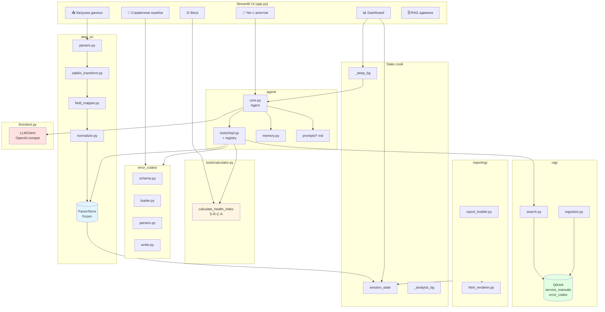
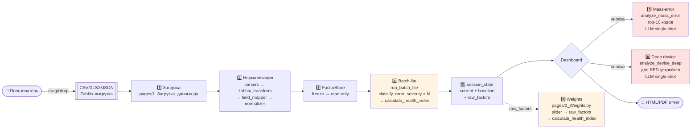

# Архитектура `mfu_agent`

AI-агент мониторинга парка МФУ. Принимает выгрузку Zabbix (или любой CSV/XLSX/JSON), для каждого устройства считает **интегральный индекс здоровья H ∈ [1..100]**, классифицирует устройства по зонам и генерирует HTML/PDF-отчёт с объяснением причин снижения и рекомендациями.

---

## Два представления

- **Диаграмма компонентов** — что с чем общается в памяти процесса.
- **Диаграмма pipeline** — как данные путешествуют от пользовательского файла до отчёта.

---

## Диаграмма компонентов



---

## Диаграмма pipeline (9 этапов)



---

## Этапы pipeline

### Этап 1 — Загрузка файла

[pages/1_Загрузка_данных.py:310](../pages/1_Загрузка_данных.py)

- Пользователь кидает файл (CSV/TSV/JSON/JSONL/NDJSON/XLSX, до 200 МБ) через `st.file_uploader`.
- `_strip_csv_preamble` чистит SQL-комментарии и служебный текст в начале.
- В отдельный поток стартует `_run_analysis_worker`, который вызывает `ingest_file()` из [data_io/normalizer.py](../data_io/normalizer.py).

### Этап 2 — Нормализация

[data_io/normalizer.py](../data_io/normalizer.py)

1. **Парсинг файла** → DataFrame ([parsers.py](../data_io/parsers.py)).
2. **Zabbix long-format трансформация** ([zabbix_transform.py](../data_io/zabbix_transform.py)): `item_key` → метаданные / расходники / ошибки. Строки с префиксом `errdisp`/`errorondisplay` становятся событиями.
3. **FieldMapper** ([field_mapper.py](../data_io/field_mapper.py)) за 4 прохода распознаёт колонки: сохранённый профиль → synonyms yaml → эвристика по содержимому → LLM-fallback.
4. **Normalizer** каждой строкой:
   - `parse_timestamp` (Unix + 8 форматов + dateutil),
   - `normalize_error_code` (regex Xerox `XX-YYY-ZZ`, стрипы "Error:", "Код:"),
   - `canonicalize_model` по [configs/model_aliases.yaml](../configs/model_aliases.yaml),
   - `detect_resource_unit` (percent/fraction/raw → %).
5. Ряд с `error_code/description` → `NormalizedEvent`; ряд с `toner/drum/fuser/mileage` → `ResourceSnapshot` (по устройству берётся самый свежий).

### Этап 3 — FactorStore

[data_io/factor_store.py](../data_io/factor_store.py)

- `fs = FactorStore()`; заполняется `add_events()` / `set_resources()` / `set_device_metadata()` / `set_fleet_meta()` / `set_reference_time()`.
- `fs.freeze()` делает стор **иммутабельным** — дальше только чтение. Воркеры могут читать параллельно без блокировок.

### Этап 4 — Batch-lite (детерминированный расчёт H)

[agent/core.py `run_batch_lite`](../agent/core.py) + [tools/calculator.py](../tools/calculator.py)

Для каждого устройства:

1. `factor_store.get_events(device_id, window_days=30)` + `get_resources` + `get_device_metadata`.
2. Группировка событий по `error_code` с **latest-timestamp-per-code** (один Factor на уникальный код, timestamp самого свежего события).
3. `classify_error_severity` (registry → heuristic → RAG → LLM fallback) + `count_error_repetitions`.
4. Чистая функция `calculate_health_index`:

   ```
   H = max(1, 100 − Σ(S · R · C · A))
   ```

   | Модификатор | Значение |
   |---|---|
   | **S** | вес severity из `WeightsProfile` (critical=60, high=20, medium=10, low=3, info=0) |
   | **R** | `min(R_max, 1 + log_base(n))` — повторяемость |
   | **C** | контекст (низкий тонер, высокий mileage и т.д.) |
   | **A** | `exp(−days / τ)` — возрастной спад |

5. Confidence: `max(min_conf, Π penalties)` со штрафами за отсутствие RAG / resources / model.
6. Зона: `H ≥ green_threshold` (75) / `< red_threshold` (40) / жёлтая посередине.

### Этап 5 — Сохранение в session_state

[state/session.py](../state/session.py)

```python
set_current_health_results(results)   # живые, могут меняться при пересчёте
set_baseline_health_results(results)  # снимок "как было" для Weights-страницы
set_raw_factors(raw_factors_map)      # device_id → list[dict] для пересчёта
set_current_factor_store(fs)
set_active_weights_profile(wp)
```

Фоновые воркеры используют модульный state в [state/_analysis_bg.py](../state/_analysis_bg.py) и [state/_deep_bg.py](../state/_deep_bg.py) — session_state из Streamlit-thread'а в фоновом потоке недоступен.

### Этап 6 — Dashboard

[pages/2_Dashboard.py](../pages/2_Dashboard.py)

- Читает session_state → рисует метрики, зоны, таблицу.
- Две кнопки запускают фоновые воркеры:
  - **Mass error** — [_run_mass_error_worker](../pages/2_Dashboard.py) → Этап 7.
  - **Red zone** — [_run_red_zone_worker](../pages/2_Dashboard.py) → Этап 8.
- Прогресс течёт через `_deep.progress`; UI авто-рефрешится `time.sleep(2); st.rerun()`.

### Этап 7 — Mass error analysis (LLM, single-shot)

[agent/core.py `analyze_mass_error`](../agent/core.py) + [prompts/mass_error_analysis.md](../agent/prompts/mass_error_analysis.md)

- `_fetch_rag_context(code, desc)` — keyword-скан в Qdrant `error_codes`, fallback на семантический поиск.
- Один LLM-вызов с `response_schema` (7 полей), `temp=0.3`, `max_tokens=2500`.
- `_robust_json_parse` + `strip_reasoning_artifacts` (чистит `<think>…</think>` от reasoning-моделей).
- **Выход:** `MassErrorAnalysis` (is_systemic, what_is_this, why_this_pattern, business_impact, immediate_action, long_term_action, indicators_to_watch).

### Этап 8 — Deep device analysis (LLM, single-shot)

[agent/core.py `analyze_device_deep`](../agent/core.py) + [prompts/device_deep_analysis.md](../agent/prompts/device_deep_analysis.md)

Для каждого RED-устройства:

1. factor_store: metadata (model), events (≤20 последних за 30 дней), resources.
2. Top-3 `factor_contributions` → форматированный список с penalty, S, R, C.
3. RAG по top-3 кодам (`_fetch_rag_context(..., top_k=1)`), склейка до 2000 символов.
4. Один LLM-вызов (`response_schema` 5 полей, `temp=0.3`).
5. Постобработка: clamp `health_index_llm ∈ [1..100]`, обрезка полей.

**Выход:** `DeepDeviceAnalysis` (health_index_llm, root_cause, recommended_action, explanation, related_codes).

### Этап 9 — Weights page (пересчёт)

[pages/3_Weights.py](../pages/3_Weights.py)

- Слайдеры для всех параметров `WeightsProfile`.
- По кнопке пересчёта: для каждого устройства берутся `raw_factors` из session_state (сохранённые в Этапе 4) и прогоняются через ту же чистую `calculate_health_index` с новым профилем.
- Сравнение с `baseline_health_results`: таблица `device | H_было | H_стало | Δ | zone_было → zone_стало`.

---

## Структура пакета

```
mfu_agent/
├── app.py                  # entrypoint, st.navigation
├── agent/
│   ├── core.py             # Agent: run_batch_lite, analyze_mass_error,
│   │                       # analyze_device_deep, run_chat
│   ├── memory.py           # LearnedPattern persistence
│   ├── tools/
│   │   ├── impl.py         # реализация 10+ tools
│   │   └── registry.py     # реестр tools для LLM tool-calling
│   └── prompts/*.md        # LLM-промпты (не markdown-контент, а runtime-код)
├── data_io/
│   ├── parsers.py          # CSV/XLSX/JSON → DataFrame
│   ├── zabbix_transform.py # long-format → события/ресурсы
│   ├── field_mapper.py     # 4-уровневое распознавание колонок
│   ├── normalizer.py       # ingest_file() — единая точка входа ingestion
│   ├── factor_store.py     # immutable хранилище событий/ресурсов
│   ├── models.py           # Pydantic: NormalizedEvent, HealthResult, ...
│   └── preamble.py         # стрип SQL-комментариев из CSV
├── tools/
│   └── calculator.py       # чистая calculate_health_index (S·R·C·A)
├── llm/
│   └── client.py           # OpenAI-совместимый клиент + strip_reasoning_artifacts
├── rag/
│   ├── ingestion.py        # → Qdrant
│   ├── search.py           # keyword + semantic + reranker
│   └── reindex_error_codes.py
├── error_codes/
│   ├── schema.py           # Pydantic ErrorCode, ModelErrorCodes
│   ├── loader.py           # load per-model YAML
│   ├── parsers.py          # CSV/XLSX/YAML import
│   ├── writer.py           # save + backup в _trash/
│   ├── consistency.py      # conflict detection
│   └── aliases.py          # model_aliases.yaml CRUD
├── pages/                  # Streamlit pages
│   ├── 1_Загрузка_данных.py
│   ├── 2_Dashboard.py
│   ├── 3_Weights.py
│   ├── 4_LLM_Chat.py
│   ├── 5_Error_Codes.py
│   └── 5_RAG_Admin.py
├── reporting/
│   ├── report_builder.py
│   └── html_renderer.py
├── state/
│   ├── session.py          # session_state обёртки
│   ├── singletons.py       # factor_store / llm / rag кэш
│   ├── _analysis_bg.py     # thread-state для ingestion-воркера
│   └── _deep_bg.py         # thread-state для deep/mass воркеров
├── configs/
│   ├── weights/default.yaml
│   ├── model_aliases.yaml
│   ├── field_synonyms.yaml
│   ├── llm_endpoints.yaml
│   ├── error_codes/{vendor}/{model_slug}.yaml
│   └── _backups/           # автобэкапы model_aliases.yaml
├── scripts/
│   └── migrate_error_codes.py
├── tests/                  # 741+ тестов
└── docs/
    └── ARCHITECTURE.md     # этот файл
```

---

## Ключевые инварианты

| # | Инвариант | Следствие |
|---|---|---|
| 1 | `FactorStore` иммутабелен после `freeze()` | Воркеры читают параллельно без блокировок |
| 2 | Чистая `calculate_health_index` | Один путь и для первичного batch, и для пересчёта в Weights — воспроизводимо |
| 3 | Raw factors сохраняются в session_state на Этапе 4 | Пересчёт весов без повторного прогона агента |
| 4 | Module-level state для фоновых thread'ов | `session_state` Streamlit недоступен из thread'а — воркеры пишут в `_deep_bg.progress` |
| 5 | **Latest-timestamp-per-code** группировка | Factor отражает свежесть ошибки, age-модификатор A корректен |
| 6 | Two-tier LLM | Быстрый lite batch (один tool-call на код) → отложенный deep single-shot только для red-зоны |
| 7 | Severity-классификация многоуровневая | Xerox registry (conf=0.9) → heuristic → RAG → LLM fallback → `_CLASSIFY_FALLBACK` |
| 8 | `strip_reasoning_artifacts` везде | `<think>…</think>` от Qwen/Nemotron вычищаются перед показом пользователю |

---

## Внешние зависимости

| Сервис | Порт | Назначение |
|---|---|---|
| llama-server (Qwen 2.5 32B Q4_K_M) | 8000 | OpenAI-совместимый LLM, `-ngl 55 -c 16384 --chat-template chatml` |
| Qdrant | 6333 | Векторное хранилище: `service_manuals` (1292) + `error_codes` (424) |
| Streamlit | 8503 | Web UI |

---

## Потоки данных в одном предложении

> Пользователь загружает Zabbix-файл → парсер нормализует строки в `NormalizedEvent` + `ResourceSnapshot` → `FactorStore.freeze()` → `run_batch_lite` для каждого устройства считает `H = 100 − Σ(S·R·C·A)` → результат в session_state → Dashboard рисует зоны и по кнопкам запускает LLM-анализ массовых ошибок и red-устройств → Weights-страница пересчитывает H с новыми весами без повторного прогона агента.
